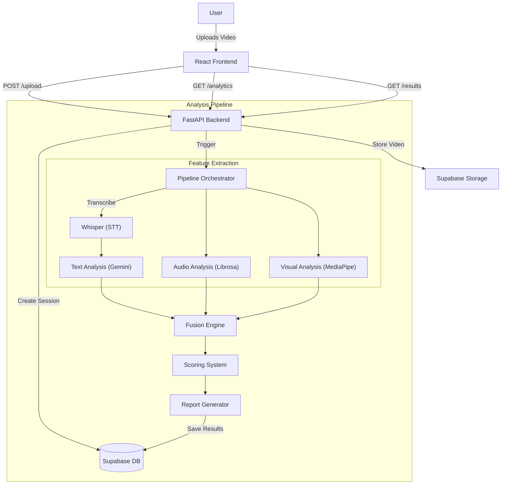

# System Architecture

## High-Level Overview

MentorMetrics is a multimodal AI coaching platform that analyzes teaching videos to provide actionable feedback. The system uses a microservices-inspired architecture with a React frontend and a FastAPI backend, leveraging Supabase for data and file storage.

## Core Components

### 1. Frontend Application
- **Framework**: React (Vite)
- **Styling**: Tailwind CSS (Brutalist Design System)
- **State Management**: React Hooks & Context
- **Key Features**:
    - **Dashboard**: Real-time analytics, trend visualization, and session management.
    - **Upload Interface**: Drag-and-drop video upload with progress tracking.
    - **Results Page**: Detailed breakdown of scores, actionable tips, and transcript viewer.
    - **Transcript Viewer**: Interactive transcript with search and download capabilities.

### 2. Backend API
- **Framework**: FastAPI
- **Language**: Python 3.10+
- **Responsibilities**:
    - API endpoints for upload, processing, and analytics.
    - Pipeline orchestration and job management.
    - Integration with Supabase and AI services.

### 3. Analysis Pipeline
The core intelligence of the platform, divided into three modalities:

- **Audio Analysis**:
    - Uses `librosa` to analyze speech patterns.
    - Metrics: WPM (Words Per Minute), Silence Ratio, Clarity Score.
    
- **Visual Analysis**:
    - Uses `MediaPipe` for pose and face detection.
    - Metrics: Eye Contact, Hand Gestures, Posture/Engagement.

- **Text Analysis**:
    - Uses `OpenAI Whisper` for high-accuracy transcription.
    - Uses `Google Gemini` (via LangChain/Direct API) for semantic analysis.
    - Metrics: Technical Correctness, Communication Clarity, Pacing.

### 4. Fusion & Scoring Engine
- **Fusion**: Combines normalized scores from all three modalities using a weighted average model.
- **Scoring**: Generates a final "Mentor Score" (0-10) and category sub-scores.
- **Reporting**: Generates a qualitative report with an Executive Summary, Strengths, Areas for Improvement, and Actionable Tips.

## Data Flow

1.  **Ingestion**: User uploads a video. The file is streamed to Supabase Storage, and a session record is created.
2.  **Processing**: The backend initiates an asynchronous processing job.
3.  **Extraction**:
    - Audio is extracted from the video.
    - Speech is transcribed to text.
    - Visual frames are sampled and analyzed.
4.  **Analysis**: Each modality is analyzed independently to generate raw metrics.
5.  **Fusion**: Raw metrics are normalized and fused to create high-level scores.
6.  **Reporting**: An LLM generates a human-readable report based on the scores and transcript.
7.  **Delivery**: The frontend polls for status and displays the final results on the Dashboard.

## Infrastructure

- **Database**: Supabase (PostgreSQL) for structured data (sessions, users, scores).
- **Storage**: Supabase Storage for video files and assets.
- **Authentication**: Supabase Auth (with Development Mode bypass).
- **Deployment**: Docker-ready for containerized deployment.
